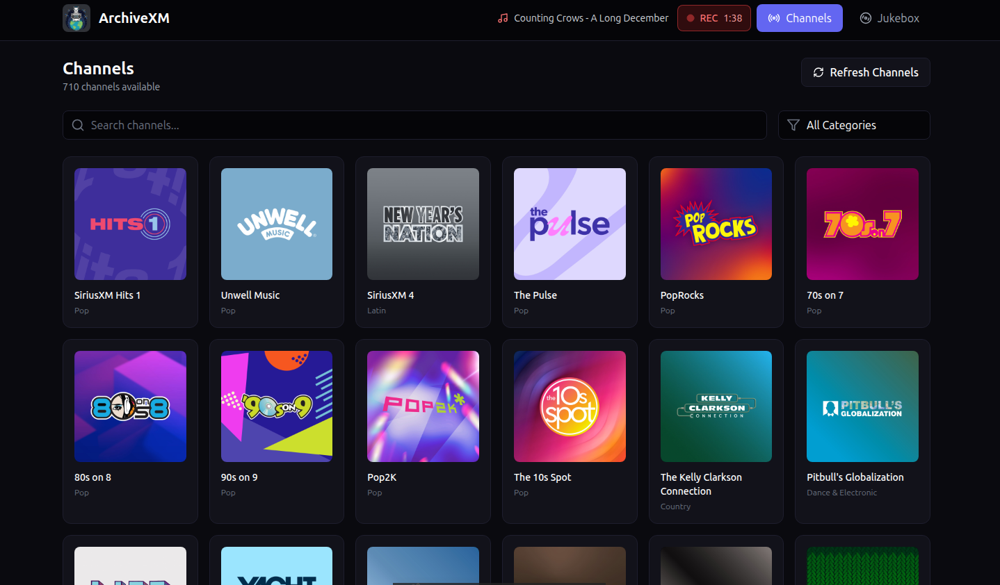
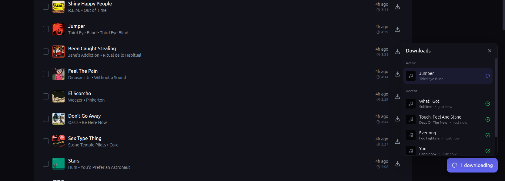
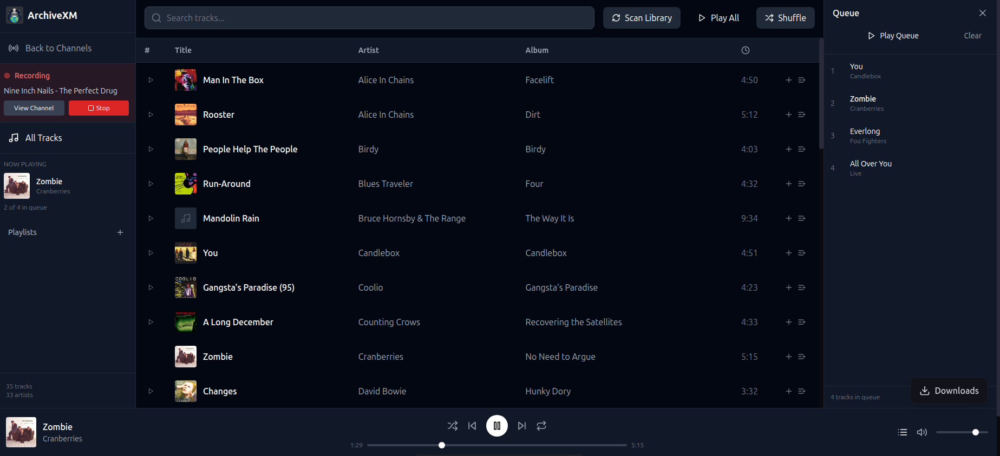
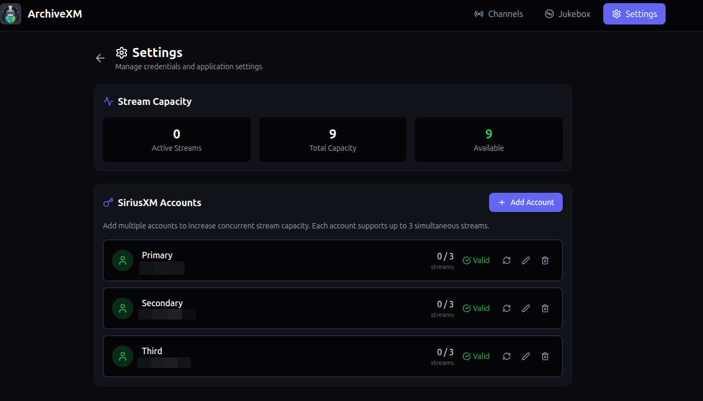

# ArchiveXM

<p align="center">
  
</p>

**ArchiveXM** is a modern web-based SiriusXM streaming and archival application. Browse 700+ channels, listen live, explore the 5-hour DVR buffer, download tracks with full metadata, and enjoy your collection with the built-in Jukebox player.

<p align="center">
  
</p>

## Features

- 🔐 **Secure Authentication** - Store SiriusXM credentials securely with auto-refresh
- 📻 **700+ Channels** - Browse all channels with artwork and descriptions
- 🎧 **Listen Live** - Stream any channel in real-time
- 📼 **DVR Buffer** - Access 5 hours of past content per channel
- ⬇️ **Download Tracks** - Download individual or bulk tracks with metadata
- 🎨 **Cover Art** - Automatic cover art embedding
- 🏷️ **Metadata Tagging** - Full ID3 tags (artist, title, album, etc.)
- 🎬 **Live Recording** - Record live streams with auto-track splitting
- 🎵 **Jukebox Player** - Full-featured local music player with playlists and queue management
- 👥 **Multi-Account Support** - Add multiple SiriusXM accounts for increased stream capacity

## Quick Start

### Prerequisites

- Docker and Docker Compose
- SiriusXM subscription with streaming access

### Installation

1. Clone the repository:
```bash
git clone https://github.com/yourusername/ArchiveXM.git
cd ArchiveXM
```

2. Start the application:
```bash
docker-compose up -d
```

3. Open your browser to `http://localhost:8743`

4. Enter your SiriusXM credentials and configure download location

### Configuration

Edit `.env` file or environment variables:

| Variable | Default | Description |
|----------|---------|-------------|
| `FRONTEND_PORT` | 8743 | Web UI port |
| `BACKEND_PORT` | 8742 | API port |
| `DOWNLOAD_PATH` | ./downloads | Local download directory |

### Ports

- **8743** - Web interface
- **8742** - Backend API

## Architecture

```
ArchiveXM/
├── backend/           # FastAPI Python backend
│   ├── services/      # Auth, API, HLS, Download services
│   ├── models/        # Database models
│   └── routers/       # API endpoints
├── frontend/          # React + Vite + TailwindCSS
│   ├── src/
│   │   ├── components/
│   │   ├── pages/
│   │   └── services/
├── data/              # SQLite database, config
├── downloads/         # Downloaded tracks
└── docker-compose.yml
```

## Tech Stack

**Backend:**
- Python 3.11+
- FastAPI
- SQLAlchemy
- httpx (async HTTP client)
- Mutagen (audio metadata)
- FFmpeg (audio processing)

**Frontend:**
- React 18
- Vite
- TailwindCSS
- HLS.js (live streaming)
- Lucide Icons
- React Router

## Screenshots

### Channel Browser
Browse 700+ SiriusXM channels with artwork, search, and category filtering.

<p align="center">
  
</p>

### Channel Detail & Live Recording
View station history, now playing info, and record live streams with automatic track splitting.

<p align="center">
  
</p>

### DVR Buffer & Downloads
Access 5 hours of past content and download tracks with full metadata and cover art.

<p align="center">
  
</p>

<p align="center">
  
</p>

### Jukebox Player
Full-featured music player with queue management, playlists, and playback controls.

<p align="center">
  
</p>

### Multi-Account Settings
Manage multiple SiriusXM accounts to increase concurrent stream capacity.

<p align="center">
  
</p>

## Jukebox Player

The built-in Jukebox lets you enjoy your downloaded music collection:

- 🎵 **Library Browser** - View all tracks, artists, and albums
- 🔀 **Queue Management** - Build and manage playback queue
- 📋 **Playlists** - Create and manage custom playlists
- 🔁 **Playback Controls** - Shuffle, repeat, seek, volume
- 🔍 **Search** - Quick search across your library

Access the Jukebox from the navigation bar after downloading some tracks.

## License

MIT License - See LICENSE file for details.

## Acknowledgments

- SiriusXM for providing the streaming service
